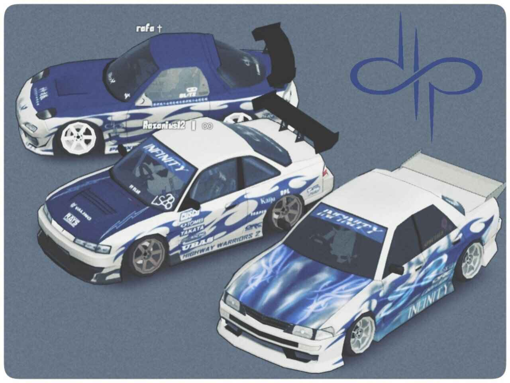

# Infinity Works Website

[](https://razanius12.github.io/InfinityWorks/)

A modern, responsive website for the Infinity drift team community. INFINITY represents a step forward in redefining what a drift team should look like.

## Live Preview

The website is available at:
- GitHub Pages: [https://razanius12.github.io/InfinityWorks/](https://razanius12.github.io/InfinityWorks/)
- Alternate URL: [https://infinityworks.rf.gd/](https://infinityworks.rf.gd/)

## Features

- Responsive design that works across all devices
- Modern UI with smooth animations and transitions
- Team member profiles with social links
- Embedded YouTube Video gallery showcasing drift content
- Dynamic photo gallery of team activities
- Bootstrap 5 framework integration
- Custom CSS styling

## Technologies Used

- HTML5
- CSS3
- JavaScript
- jQuery
- Bootstrap 5
- Bootstrap Icons
- Google Fonts

## Sections

1. **Home** - Welcome section with team introduction
2. **About** - Team history and mission statement
3. **Members** - Team member profiles with social links
4. **Videos** - YouTube video gallery
5. **Gallery** - Dynamic photo gallery
6. **Discord** - Community invitation section

## How to Modify the Page

### Changing Text Content

1. Open the `index.html` file.
2. Locate the section you want to modify by searching for the relevant text.
3. Edit the text within the HTML tags.

### Modifying Custom Styles

1. Open the `css/templatemo-festava-live.css` file.
2. Locate the CSS rules you want to modify.
3. Edit the CSS properties as needed.

### Updating Images

1. Replace the image files in the `images` directory with your new images.
2. Ensure the new images have the same file names as the old ones, or update the `src` attributes in the `index.html` file to match the new file names.

### Updating Video/Image on Hero Section

1. Open the `index.html` file.
2. Locate the `<section class="hero-section" id="section_1">` block.
3. To update the video, replace the `<source>` tags within the `<video>` tag with new video sources.
4. To update the image, replace the `poster` attribute of the `<video>` tag with the new image path.
5. The `retryLoadVideo(video, attempt)` function in the `js/custom.js` ensures that the video loads correctly by retrying the load operation with exponential backoff if the video is not near the viewport or fails to load initially. It uses an intersection observer to load the video when it comes into view and retries loading up to a maximum number of attempts with increasing intervals. You can modify the `maxAttempts` and `backoffInterval` variables to adjust the retry behavior.
6. The video is split into four sources to ensure compatibility and fallback options for different browsers.

### Adding New Team Members

1. Open the `index.html` file.
2. Locate the `Members` section.
3. Copy an existing member's `<div class="col">` block and paste it where you want the new member to appear.
4. Update the image `src`, member name, role, and quote.
5. If using the carousel, also add the new member's `<div class="carousel-item">` block within the carousel structure.

### Adjusting Carousel Controls

The `adjustCarouselControls()` function in the `js/custom.js` file adjusts the visibility and positioning of the carousel controls based on the number of items and the current state of the carousel. This function ensures that the controls are correctly positioned and visible on different screen sizes.

#### How It Works

1. **Identify Active Item**: The function first identifies the currently active carousel item.
2. **Determine Screen Size**: It checks the screen size using `window.matchMedia`.
3. **Adjust Control Position**: Based on the screen size, it adjusts the position of the carousel controls (`.carousel-control-prev` and `.carousel-control-next`).

#### Example Behavior

- **Mobile Screens (max-width: 576px)**:
  - The controls are positioned based on the height of the image within the active carousel item.
- **Small Screens (max-width: 620px)**:
  - The controls are positioned at a fixed height, ensuring they are visible and accessible.
- **Larger Screens**:
  - The controls are reset to their default positions.

#### How to Modify

1. **Change Control Positioning**:
   - To change the positioning of the controls for mobile screens, modify the `topPosition` calculation within the `if (window.matchMedia('(max-width: 576px)').matches)` block.
   - Example:
     ```javascript
     if (window.matchMedia('(max-width: 576px)').matches) {
       const topPosition = imageHeight - 50; // Adjusted from -24 to -50
       if (prevControl) prevControl.style.top = `${topPosition}px`;
       if (nextControl) nextControl.style.top = `${topPosition}px`;
     }
     ```

2. **Add New Screen Size Conditions**:
   - To add a new condition for a different screen size, add a new `else if` block with the desired `window.matchMedia` query.
   - Example:
     ```javascript
     else if (window.matchMedia('(max-width: 768px)').matches) {
       const topPosition = 200; // Custom position for screens up to 768px
       if (prevControl) prevControl.style.top = `${topPosition}px`;
       if (nextControl) nextControl.style.top = `${topPosition}px`;
     }
     ```

3. **Modify Control Visibility**:
   - To hide or show the controls based on the number of items, you can add logic to check the number of carousel items and adjust the visibility accordingly.
   - Example:
     ```javascript
     const carouselItems = document.querySelectorAll('.carousel-item');
     if (carouselItems.length <= 1) {
       if (prevControl) prevControl.style.display = 'none';
       if (nextControl) nextControl.style.display = 'none';
     } else {
       if (prevControl) prevControl.style.display = 'block';
       if (nextControl) nextControl.style.display = 'block';
     }
     ```

### Adding New Videos on Videos (Youtube Embedded) Section

1. Open the `index.html` file.
2. Locate the `Videos` section.
3. Copy an existing `<div class="col-auto">` block containing an `<iframe>` and paste it where you want the new video to appear.
4. Update the `src` attribute of the `<iframe>` tag with the new YouTube video URL.

### Adding New Images on Gallery Section

1. Open the `js/custom.js` file.
2. Locate the `generateImageHTML` function.
3. Update the loop range to include the new images.
4. Add the new images to the `images/gallery` directory with the appropriate naming convention.

### Adding New Sections

1. Open the `index.html` file.
2. Copy an existing section's `<section>` block and paste it where you want the new section to appear.
3. Update the `id` attribute and content as needed.
4. Add corresponding styles in the `css/templatemo-festava-live.css` file if necessary.
5. Update the `var sectionArray` in the `js/click-scroll.js` file to include the new section for smooth scrolling functionality.
   - Example:
     ```javascript
     var sectionArray = [1, 2, 3, 4, 5, 6, 7]; // Added new section with id="section_7"
     ```
6. Ensure that the new section's `id` matches the `href` attribute in the corresponding navbar link in the `index.html` file.
   - Example:
     ```html
     <li class="nav-item">
       <a class="nav-link click-scroll" href="#section_7">New Section</a>
     </li>
     ```

### Adding New Navbars

1. Open the `index.html` file.
2. Locate the `<nav>` block.
3. Copy an existing `<li class="nav-item">` block and paste it where you want the new navbar item to appear.
4. Update the `href` attribute and text content.
5. If necessary, update the JavaScript in `js/custom.js` to handle new navbar interactions.

## Social Links

- Discord: [Join Our Community](https://discord.com/invite/93xgQjW)
- Instagram: [@works_infinity](https://www.instagram.com/works_infinity)

## Theme Details

The website uses a custom color scheme:
- Primary Color: #6376ca
- Secondary Color: #273987
- Dark Color: #000000
- Background Color: #f0f8ff

## Credits

- Template based on [TemplateMo 583 Festava Live](https://templatemo.com/tm-583-festava-live)
- Distributed by [ThemeWagon](https://themewagon.com)
- Developed by [Razanius12](https://github.com/Razanius12)