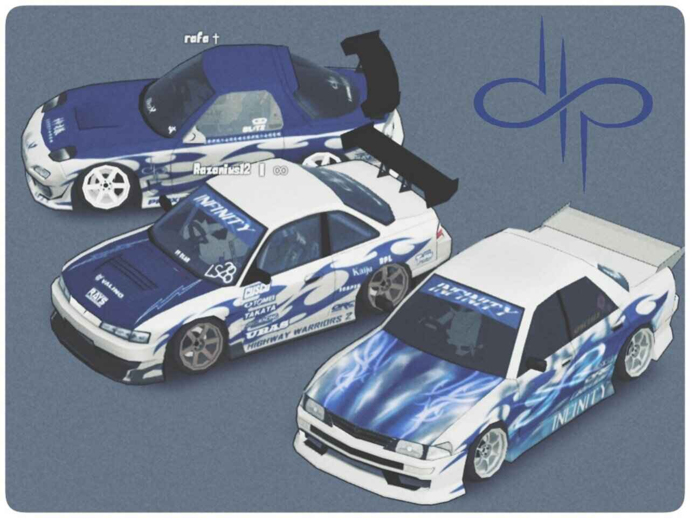

# Infinity Works Website

[](https://razanius12.github.io/InfinityWorks/)

A modern, responsive landing page for the Infinity drift racing team, built with **Astro**.

## 🚀 Live Preview

- GitHub Pages: https://razanius12.github.io/InfinityWorks/
- Main URL: https://infinityworks.rf.gd/

## ✨ Features

- Full-screen hero with floating navbar
- Responsive design (desktop, tablet, mobile)
- Team member profiles with social links
- YouTube video gallery
- Dynamic image gallery with viewer
- Image zoom controls (+ / − buttons, keyboard, scroll wheel)
- Bootstrap 5 + custom CSS
- Google Fonts (Outfit)
- Smooth animations and transitions

## 🛠️ Tech Stack

- **Framework**: Astro 4.16.19
- **Styling**: Bootstrap 5.3.0 + Custom CSS
- **Icons**: Bootstrap Icons 1.11.3
- **Fonts**: Google Fonts (Outfit)
- **API**: Intersection Observer (navbar, lazy loading, viewer)

## 📁 Project Structure

```
/src
  /components       # Reusable UI components
  /layouts         # Page layouts
  /pages           # Route pages
  /styles          # Global CSS
/public            # Static assets
  /images          # Gallery, members, logos
  /video           # Hero background video
  /fonts           # Custom fonts (if any)
```

## 🚀 Quick Start

```bash
npm install        # Install dependencies
npm install -g astro  # Optional: install Astro CLI globally
npm run dev        # Start dev server (localhost:4322)
npm run build      # Build for production (/dist)
npm run preview    # Preview production build
```

## 📝 Pages

- **Home** - Full-screen hero with floating navbar & video
- **About** - Team mission
- **Members** - Team profiles with socials
- **Videos** - YouTube gallery
- **Gallery** - Image gallery with zoom viewer
- **Game Appearances** - In-game showcase

## 🎨 Customization

### Styling
- Global styles: `/src/styles/globals.css` (single, clean file)
- Components use Bootstrap 5 + custom CSS

### Images & Video
- Replace files in `/public/images/` and `/public/video/`
- Update component data arrays in `/src/components/*.astro`

### Team Members
- Edit members array in `/src/components/Members.astro`
- Add photos to `/public/images/members/`

### Gallery Images
- Add 23 gallery images to `/public/images/gallery/1.jpg` through `23.jpg`
- Images load dynamically from JavaScript in `/src/layouts/Layout.astro`

## 🚢 Deployment

```bash
npm run build      # Creates /dist folder
# Deploy the /dist folder to your hosting service
```

#### How It Works

1. **Identify Active Item**: The function first identifies the currently active carousel item.
2. **Determine Screen Size**: It checks the screen size using `window.matchMedia`.
3. **Adjust Control Position**: Based on the screen size, it adjusts the position of the carousel controls (`.carousel-control-prev` and `.carousel-control-next`).

#### Example Behavior

- **Mobile Screens (max-width: 576px)**:
  - The controls are positioned based on the height of the image within the active carousel item.
- **Small Screens (max-width: 620px)**:
  - The controls are positioned at a fixed height, ensuring they are visible and accessible.
- **Larger Screens**:
  - The controls are reset to their default positions.

#### How to Modify

1. **Change Control Positioning**:
   - To change the positioning of the controls for mobile screens, modify the `topPosition` calculation within the `if (window.matchMedia('(max-width: 576px)').matches)` block.
   - Example:

     ```javascript
     if (window.matchMedia('(max-width: 576px)').matches) {
       const topPosition = imageHeight - 50; // Adjusted from -24 to -50
       if (prevControl) prevControl.style.top = `${topPosition}px`;
       if (nextControl) nextControl.style.top = `${topPosition}px`;
     }
     ```

2. **Add New Screen Size Conditions**:
   - To add a new condition for a different screen size, add a new `else if` block with the desired `window.matchMedia` query.
   - Example:

     ```javascript
     else if (window.matchMedia('(max-width: 768px)').matches) {
       const topPosition = 200; // Custom position for screens up to 768px
       if (prevControl) prevControl.style.top = `${topPosition}px`;
       if (nextControl) nextControl.style.top = `${topPosition}px`;
     }
     ```

3. **Modify Control Visibility**:
   - To hide or show the controls based on the number of items, you can add logic to check the number of carousel items and adjust the visibility accordingly.
   - Example:

     ```javascript
     const carouselItems = document.querySelectorAll('.carousel-item');
     if (carouselItems.length <= 1) {
       if (prevControl) prevControl.style.display = 'none';
       if (nextControl) nextControl.style.display = 'none';
     } else {
       if (prevControl) prevControl.style.display = 'block';
       if (nextControl) nextControl.style.display = 'block';
     }
     ```

### Adding New Videos on Videos (Youtube Embedded) Section

1. Open the `index.html` file.
2. Locate the `Videos` section.
3. Copy an existing `<div class="col-auto">` block containing an `<iframe>` and paste it where you want the new video to appear.
4. Update the `src` attribute of the `<iframe>` tag with the new YouTube video URL.

### Adding New Images on Gallery Section

1. Open the `js/custom.js` file.
2. Locate the `generateImageHTML` function.
3. Update the loop range to include the new images.
4. Add the new images to the `images/gallery` directory with the appropriate naming convention.

### Adding New Sections and Navbars

1. Open the `index.html` file.
2. Copy an existing section's `<section>` block and paste it where you want the new section to appear.
3. Update the `id` attribute and content as needed.
4. Add corresponding styles in the `css/templatemo-festava-live.css` file if necessary.
5. Locate the `<nav>` block.
6. Copy an existing `<li class="nav-item">` block and paste it where you want the new navbar item to appear.
7. Update the `href` attribute and text content.
   - Example:

     ```html
     <li class="nav-item">
       <a class="nav-link click-scroll" href="#section_7">New Section</a>
     </li>
     ```

8. Update the `var sectionArray` in the `js/click-scroll.js` file to include the new section for smooth scrolling functionality.
   - Example:

     ```javascript
     var sectionArray = [1, 2, 3, 4, 5, 6, 7]; // Added new section with id="section_7"
     ```

9. Ensure that the new section's `id` matches the `href` attribute in the corresponding navbar link in the `index.html` file.
10. The function in `custom.js` handles the smooth scrolling effect when a navbar link is clicked. It uses jQuery to animate the scroll to the target section.
    - Example:

      ```javascript
      $('.smoothscroll').click(function () {
        var el = $(this).attr('href');
        var elWrapped = $(el);
        var header_height = $('.navbar').height();

        scrollToDiv(elWrapped, header_height);
        return false;

        function scrollToDiv(element, navheight) {
          var offset = element.offset();
          var offsetTop = offset.top;
          var totalScroll = offsetTop - navheight;

          $('body,html').animate({
            scrollTop: totalScroll
          }, 300);
        }
      });
      ```

11. The `click-scroll.js` file ensures that the active navbar link is highlighted based on the scroll position. It updates the active class on the navbar links as the user scrolls through the sections.
12. The `jquery.sticky.js` file makes the navbar stick to the top of the page as the user scrolls down. This ensures that the navbar is always visible for easy navigation.

## Social Links

- Discord: [Join Our Community](https://discord.com/invite/93xgQjW)
- Instagram: [@works_infinity](https://www.instagram.com/works_infinity)

## Theme Details

The website uses a custom color scheme:

- Primary Color: #6376ca
- Secondary Color: #273987
- Dark Color: #000000
- Background Color: #f0f8ff

## Credits

- Template based on [TemplateMo 583 Festava Live](https://templatemo.com/tm-583-festava-live)
- Distributed by [ThemeWagon](https://themewagon.com)
- Developed by [Razanius12](https://github.com/Razanius12)
